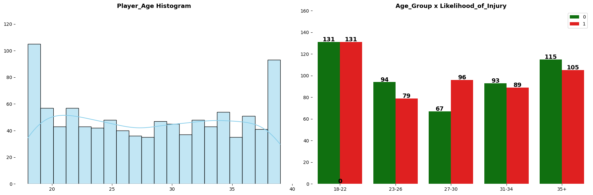
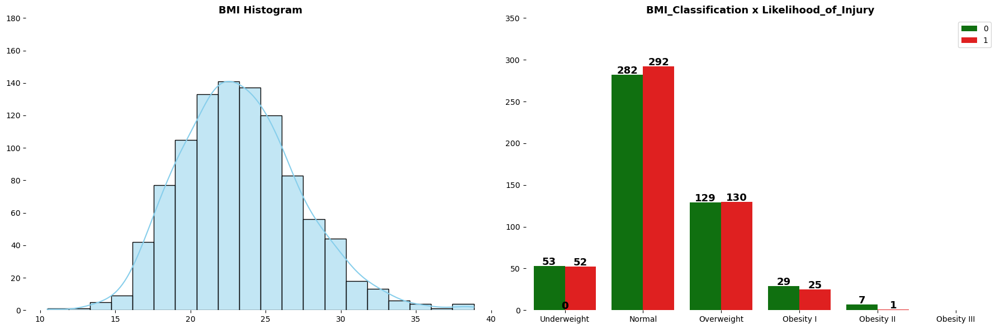
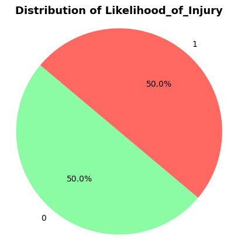
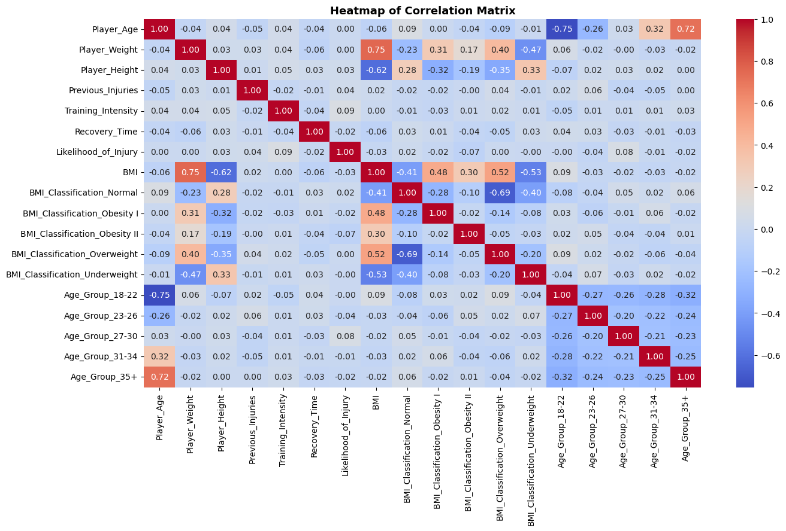
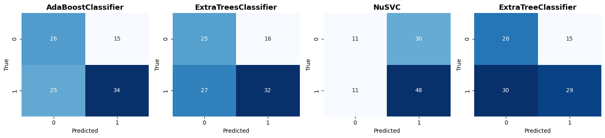
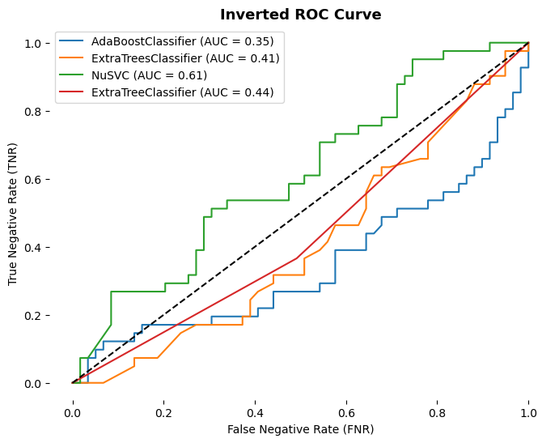
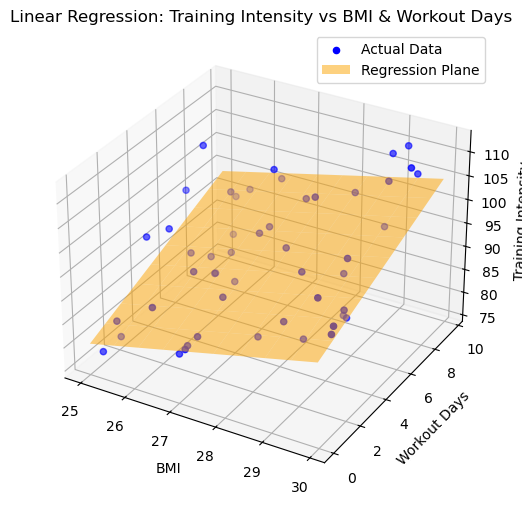
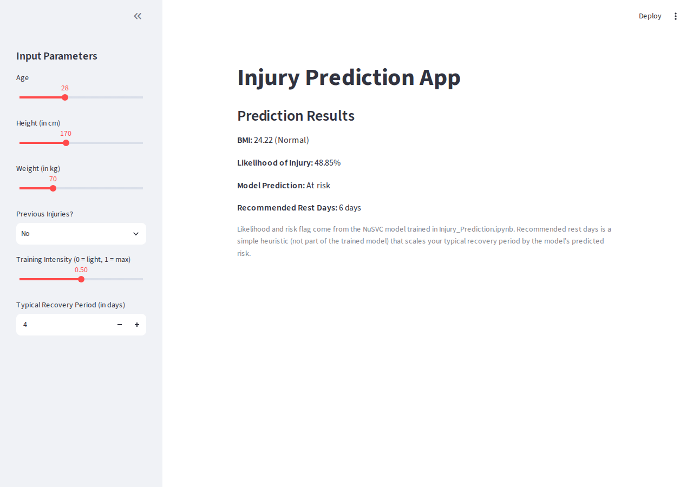
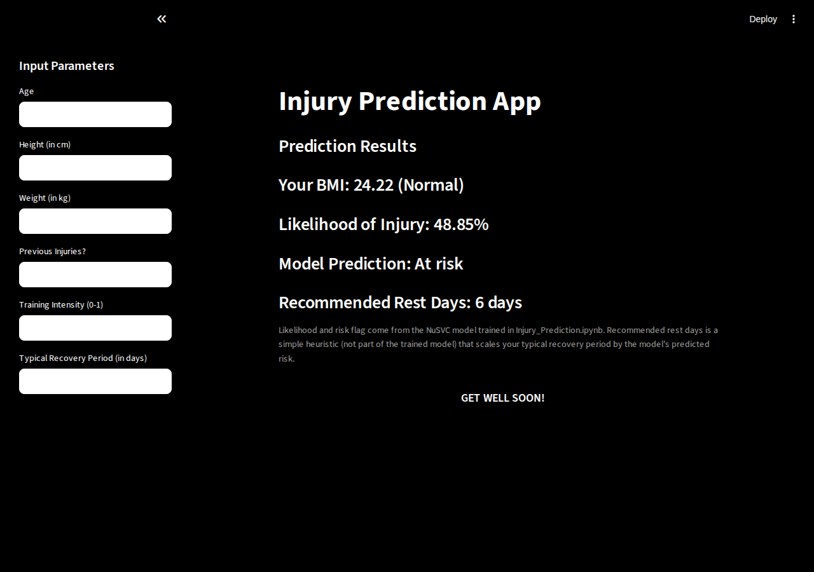

# Sports Injury Detection and Recommendation

A machine learning project that predicts an athlete's likelihood of sustaining an injury from physical and training-load data (age, weight, height, BMI, training intensity, recovery time, and injury history), and ships a simple Streamlit front end for interactive predictions.

## Motivation

Athletes and coaching staff need early warning signs of injury risk to make better decisions about training load and recovery. This project explores whether basic physical and workout metrics — the kind already tracked by most teams — carry enough signal to flag at-risk athletes, and packages the result as an interactive tool that a coach or trainer could plug numbers into.

The broader goal: reduce athlete downtime, support personalized rest/recovery recommendations, and make it easier to catch red flags (e.g. high BMI combined with high training intensity) before they turn into injuries.

## Repository Contents

| File | Description |
|---|---|
| `Injury_Prediction.ipynb` | Main analysis notebook: EDA, feature engineering, and training/comparison of 4 classifiers on `injury_data.csv` |
| `updated_sport_injury_detection.ipynb` | Follow-up notebook exploring the relationship between BMI, workout days, and training intensity via linear regression on `updated_bmi_workouts.csv` |
| `injury_data.csv` | 1,000-row dataset: `Player_Age`, `Player_Weight`, `Player_Height`, `Previous_Injuries`, `Training_Intensity`, `Recovery_Time`, `Likelihood_of_Injury` |
| `updated_bmi_workouts.csv` / `.xlsx` | 1,000-row dataset: `Player_Weight`, `Player_Height`, `Player BMI`, `Workout_Days`, `Training_Intensity` |
| `STREAMLIT.py` | Lightweight Streamlit app (slider inputs), predicts using the trained model |
| `REVIEW3.py` | Styled (dark-theme) version of the Streamlit app, predicts using the trained model |
| `train_model.py` | Reproduces the notebook's feature engineering and trains/serializes the NuSVC model used by both apps |
| `injury_model.py` | Shared inference module: loads the serialized model and turns raw form inputs into a prediction |
| `injury_model.joblib` | Serialized model + encoder + feature metadata produced by `train_model.py` |

## Data Analysis & Modeling (`Injury_Prediction.ipynb`)

### Exploratory Data Analysis
The notebook engineers a `BMI` column (and a 6-bucket `BMI_Classification`) plus a 5-bucket `Age_Group` from the raw features, then visualizes distributions of every feature against the binary `Likelihood_of_Injury` target.





The target itself is perfectly balanced (500 / 500):



A correlation heatmap over the engineered feature set shows the raw predictors are only weakly linearly correlated with `Likelihood_of_Injury` — the strongest single correlate is `Training_Intensity` at just 0.09 — suggesting injury risk in this dataset isn't explained by any one linear factor:



### Modeling
After one-hot encoding `BMI_Classification` and `Age_Group`, four classifiers were trained on a 90/10 train-test split:

- `AdaBoostClassifier`
- `ExtraTreesClassifier`
- `NuSVC`
- `ExtraTreeClassifier`

| Model | Recall | Accuracy | Precision |
|---|---|---|---|
| AdaBoostClassifier | 0.576 | 0.600 | 0.694 |
| ExtraTreesClassifier | 0.542 | 0.570 | 0.667 |
| **NuSVC** | **0.814** | 0.590 | 0.615 |
| ExtraTreeClassifier | 0.492 | 0.550 | 0.659 |

**Model selection criterion:** in a real deployment, this model would influence whether a coaching staff fields a player. A false negative (predicting "safe" when the player is actually at risk) is far costlier than a false positive, so the notebook selects on **recall** rather than accuracy — explicitly optimizing to minimize missed injury risks, even at the cost of more false alarms.





Based on recall and the ROC/confusion-matrix comparison, **NuSVC** is the chosen model — it catches over 81% of true injury-risk cases, at the cost of more false positives than the other candidates.

## BMI / Workout Analysis (`updated_sport_injury_detection.ipynb`)

A shorter, exploratory notebook that loads `updated_bmi_workouts.csv` and fits a linear regression relating `Training_Intensity` to `BMI` and `Workout_Days`, visualized as a 3D regression plane (MSE ≈ 58.3 on the demo fit):



## Streamlit App

Two versions of an interactive front end are included. **Both now call the actual trained NuSVC model** (via `injury_model.py` / `injury_model.joblib`) instead of a placeholder formula — see "What was fixed" below.

### `STREAMLIT.py` — slider-based UI

Sliders/inputs for age, height, weight, previous injuries, training intensity, and typical recovery period — the same six features the model was trained on. BMI and its classification bucket are derived automatically.



### `REVIEW3.py` — styled variant

The same inputs via text fields, with a dark-theme restyle.




### Running the app

```bash
pip install -r requirements.txt   # or see Requirements below
python train_model.py             # trains the model and writes injury_model.joblib
streamlit run STREAMLIT.py
# or
streamlit run REVIEW3.py
```

`injury_model.joblib` is included in this repo already, so `train_model.py` only needs to be re-run if `injury_data.csv` changes or you want to retrain.

## Requirements

```bash
pip install pandas numpy matplotlib seaborn scikit-learn streamlit joblib
```

## Possible Next Steps

- Expand the feature set with wearable-sensor or real-time biomechanical data, as described in the project's original motivation.
- Investigate non-linear feature interactions further, given how weak the pairwise linear correlations with `Likelihood_of_Injury` turned out to be.
- Give "Recommended Rest Days" a real basis (e.g. a regression target derived from actual recovery outcomes) instead of the current risk-scaled heuristic.
- Add input validation/warnings when age falls well outside the 18–39 range the model was trained on.
